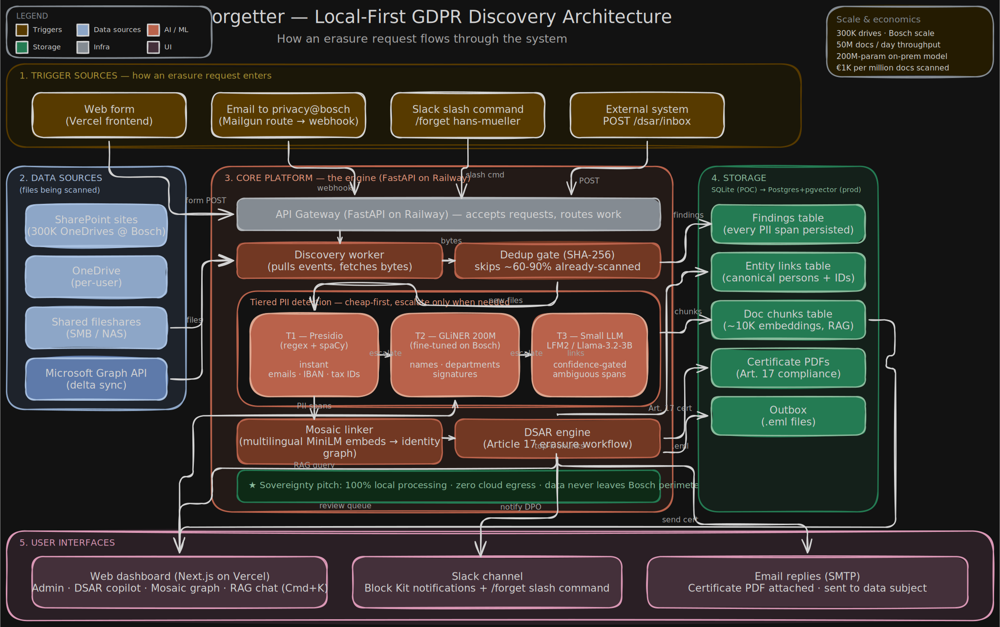

# Forgetter — Bosch GDPR Data Discovery

Local-first AI for finding personal data across SharePoint, OneDrive, and shared drives, executing GDPR Article 17 erasure requests, and proving it via signed compliance certificates. Zero cloud egress, sovereign by default.

**Live demo:** https://tracer-cyan.vercel.app
**Backend:** https://tracer-api-production.up.railway.app

## Architecture



High-level flow:

1. **Trigger** — DPO pastes an erasure email, sends to `privacy@bosch.example`, or types `/forget hans-mueller` in Slack
2. **Discovery** — Microsoft Graph delta sync pulls changed files from SharePoint/OneDrive
3. **Dedup gate** — SHA-256 content hash skips already-scanned files (60-90% cost reduction on re-scans)
4. **Tiered detection**
   - **T1** Presidio (regex + spaCy) — emails, IBANs, tax IDs, instant
   - **T2** GLiNER 200M fine-tuned on Bosch docs — names, departments, signatures
   - **T3** Small LLM (LFM2 / Llama 3.2 3B / OpenRouter) — confidence-gated for ambiguous spans
5. **Mosaic linker** — embeds person contexts via multilingual MiniLM, links identities across documents (the "re-identification risk" view)
6. **DSAR engine** — Article 17 erasure plan + approve/decline workflow + signed certificate PDF + email reply

For deeper architecture, see [DESIGN.md](DESIGN.md) and the v2 [Rust workers doc](docs/rust-workers.html).

## Repo layout

```
data_gen/    Synthetic PII dataset generator (Faker + Jinja + LLM paraphrase)
train/       GLiNER fine-tune scripts (Colab notebook included)
services/    FastAPI scan service — connectors, detectors, mosaic, DSAR, chat
frontend/    Next.js dashboard (Vercel)
tests/       pytest smoke tests for the scan service
docs/        Architecture diagram + ADR-style explainers
models/      Fine-tuned GLiNER checkpoint (gitignored)
data/        Demo files, scan DB, certificates, outbox (gitignored)
```

## Components

### Synthetic dataset pipeline (`data_gen/`)

Generates labeled NER training data for fine-tuning a PII detector on Bosch-style corporate documents. Three sources combined:

| Source        | Cost   | Role                                                      |
|---------------|--------|-----------------------------------------------------------|
| Faker + Jinja | $0     | Deterministic templated fills, perfect span labels        |
| LLM paraphrase| ~$0.50 | Prose diversity (preserve entities verbatim)              |
| Hard negatives| ~$0.40 | Non-PII business docs (teach model to NOT over-flag)      |

Default sweet-spot run produces ~5K labeled examples, split 80/10/10 train/val/test.

### Scan service (`services/`)

FastAPI app exposing the full pipeline:

| Endpoint | What |
|---|---|
| `POST /scan/file` | Scan single file → spans + tier provenance + timings |
| `GET /scan/stream` | SSE walking a connector → live progress |
| `POST /scan/all` | Comparison matrix — run each detector independently |
| `GET /findings` | Filterable findings table |
| `GET /mosaic/graph` | Force-directed entity graph payload |
| `GET /mosaic/person?q=...` | Identity panel for one person |
| `POST /dsar/inbox` | Universal DSAR intake (email/api/slack/web) |
| `POST /dsar/requests/{id}/execute` | Erase findings + generate cert + email requester |
| `GET /chat/stream` | RAG SSE — embed query, retrieve top-k chunks, stream LLM answer |
| `GET /metrics` | Prometheus |

### Frontend (`frontend/`)

Next.js 16 + Tailwind 4. Pages:

- `/` Dashboard with KPI strip and detector mix
- `/scan` Live SSE scan ticker
- `/compare` Side-by-side detector showdown
- `/mosaic` Force-directed identity graph with focus mode + Cmd+K chat
- `/dsar` Erasure inbox + intake form
- `/dsar/[id]` Per-request review w/ plan + mosaic + certificate
- `/findings` Findings ledger
- `/agents` Internal agent registry

Design system: see [DESIGN.md](DESIGN.md). Warm cream paper · Instrument Serif + Geist · editorial pills · single citrine signal accent.

## Quickstart

### Install [uv](https://github.com/astral-sh/uv)

```bash
brew install uv          # or: curl -LsSf https://astral.sh/uv/install.sh | sh
```

### Synthetic data + scan service

```bash
# Bootstrap Python deps
uv sync
cp .env.example .env     # paste OPENROUTER_API_KEY

# Generate 5K synthetic labeled docs (~15 min, ~$5 on OpenRouter)
uv run python -m data_gen.pipeline --out data/out \
  --filled 2500 --paraphrase 1500 --negatives-llm 700

# Render to PDF/DOCX/EML/TXT for the demo files folder
uv run python -m data_gen.render --in data/out/test.jsonl --out data/files

# Run scan service (zero-shot GLiNER by default)
uv run --group serve uvicorn services.app:app --reload --port 8000

# Or, with the fine-tuned model
GLINER_LOCAL_PATH=models/gliner-bosch \
  uv run --group serve uvicorn services.app:app --reload --port 8000
```

### Frontend

```bash
cd frontend
npm install
npm run dev          # http://localhost:3000
```

### Fine-tune GLiNER on the synthetic data

See [train/README.md](train/README.md). Colab notebook trains in ~30-60 min on a free T4 GPU.

## Production

Backend on Railway · Frontend on Vercel · Postgres + pgvector for v1 scale · Rust workers per [docs/rust-workers.html](docs/rust-workers.html) for v2.

```bash
# Deploy
railway up
vercel deploy --prod
```

See `Dockerfile` and `railway.json` for backend, `frontend/vercel.json` for frontend.

## Entity labels we detect

`PERSON · EMPLOYEE_ID · EMAIL · PHONE · ADDRESS · TAX_ID · IBAN · DEPARTMENT · COMPANY · DATE · ID_NUMBER · SIGNATURE · USERNAME`

## License

Hackathon prototype. Not licensed for redistribution.
